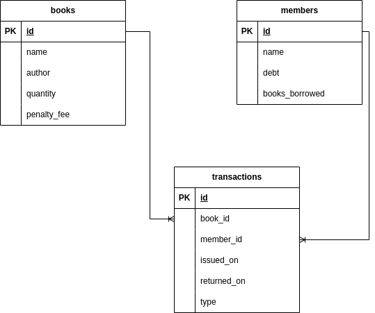

# BookNest Server
This project has been deployed on AWS and can be accessed via the following link: [BookNest Server](https://booknest.api.symonmuchemi.tech/)

## Table of Contents

- [BookNest Server](#booknest-server)
  - [Table of Contents](#table-of-contents)
  - [Project Description](#project-description)
  - [Installation](#installation)
  - [Running the application](#running-the-application)
  - [Running the tests](#running-the-tests)
  - [Used Technologies](#used-technologies)
  - [Features](#features)
  - [API Endpoints](#api-endpoints)
    - [Books](#books)
    - [Members](#members)
    - [Transactions](#transactions)
  - [Database Design](#database-design)
  - [Author](#author)

## Project Description

This project is a Flask application API designed to help librarians manage and track books issued to members. It allows librarians to track the quantity of books available, monitor book fees and also members registration update and deletion. The API also maintains records of transactions made; issuance and retrieval of books from members.

## Installation

1. Clone the repository

```bash
git clone https://github.com/SymonMuchemi/BookNest-Server.git
```

2. Change directory to the project folder

```bash
cd BookNest-Server
```

3. Create a virtual environment

```bash
python3 -m venv venv
```

4. Activate the virtual environment

On Linux:

```bash
source venv/bin/activate
```

On Windows:

```bash
venv\Scripts\activate
```

5. Install the project dependencies

```bash
pip install -r requirements.txt
```

## Running the application

1. Set the environment variables

```bash
export FLASK_APP=app
export FLASK_ENV=development
```

2. Run the application

```bash
flask run
```

## Running the tests

```bash
python -m unittest discover tests
```

## Used Technologies

- Python3: The programming language used to build the application.
- Flask: The web framework used to build the application.
- SQLite: The database used to store the application data.
- SQLAlchemy: The ORM used to interact with the database.
- Unittest: The testing framework used to test the application.
- Pydantic: The data validation library used to validate the request data.

## Features

- [x] Librarian can add, update, delete and view books in the library
- [x] Librarian can add, update, delete and view members in the library
- [x] Librarian can issue books to members
- [x] Librarian can retrieve books from members
- [x] Librarian can view all transactions made
- [x] Member's debt increments after borrow period exceeds set borrow period (7 Days)
- [x] Member's debt and transaction charge is capped at 500.

## API Endpoints

### Books

- `GET /api/get_books`: Get all books
- `POST /api/books/create`: Create a new book
- `PUT /api/books/update/<int:book_id>`: Update a book
- `DELETE /api/books/delete/<int:book_id>`: Delete a book
- `GET /api/books/get_by_id/<int:book_id>`: Get a book by id
- `GET /api/books/get_by_title/<string:book_title>`: Get a book by title
- `GET /api/books/get_by_author/<string:book_author>`: Get a book by author
- `GET /api/books/hello`: Test endpoint

### Members

- `GET /api/members/get_members`: Get all members.
- `POST /api/members/create`: Create a new member.
- `PUT /api/members/update/<int:member_id>`: Update a member.
- `DELETE /api/members/delete/<int:member_id>`: Delete a member.
- `GET /api/members/get_by_id/<int:member_id>`: Get a member by id.
- `GET /api/members/hello`: Test endpoint.

### Transactions

- `GET /api/transactions/get_transactions`: Get all transactions.
- `POST /api/transactions/issue_book`: Issue a book to a member.
- `POST /api/transactions/retrieve_book`: Retrieve a book from a member.
- `GET /api/transactions/hello`: Test endpoint.

## Database Design

The database design is shown in the image below:



## Author

- [Symon Muchemi](https://github.com/symonmuchemi)
